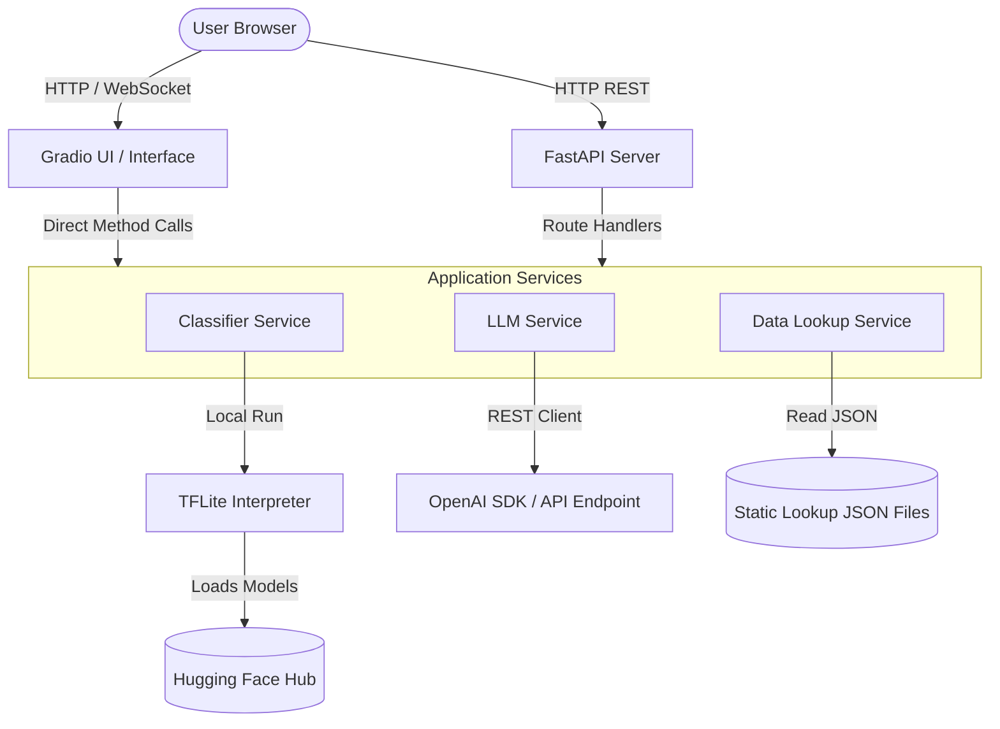

# System Architecture

## 1. Overview
The Sunflower Ensemble Classifier (SEC) is structured as a unified Python web application. It runs a **FastAPI backend** that exposes REST API endpoints, alongside a **Gradio frontend** mounted directly onto the FastAPI application instance. The entire stack executes within a single Docker container, facilitating deployment to Hugging Face Spaces.

---

## 2. Component Design

### Frontend (Gradio App)
*   Mounted via `gr.mount_gradio_app(app, demo, path="/")` directly onto the FastAPI application.
*   Presents a clean, responsive 3-tab layout corresponding to the 3 modes:
    1.  **Leaf Disease Tab**: Image upload element, submit button, output classification labels + confidence progress bars, and an agronomic info panel.
    2.  **Growth Stage Tab**: Image upload element, submit button, growth stage output labels + confidence, and a harvest-time estimate display.
    3.  **Combined Analysis Tab**: Dual image upload slots, submit button, side-by-side classification displays, and a large agronomist report panel presenting the LLM-derived compatibility analysis.

### Backend REST API (FastAPI)
*   Exposes endpoints under `/api/v1` for programmatic integration (e.g., `/api/v1/predict/disease`, `/api/v1/predict/growth`, `/api/v1/predict/combined`).
*   Validates requests via Pydantic models.
*   Enforces error boundary handling, returning clean JSON errors to clients instead of raw stack traces.

### ML Classifier Service (TFLite)
*   **Model Sourcing**: Pulls model files on startup or first request from the Hugging Face model repository `Jibon4744/SEC-sunflower-classifier`.
*   **Inference Engine**: Uses the lightweight `tflite-runtime` library (or `tensorflow` CPU-only depending on container optimization) to load models and run predictions on local CPU.
*   **Preprocessing**: Handles image resizing, color conversion (RGB), and normalization before running inference.

### LLM Orchestrator Service
*   Utilizes the `openai` SDK as a wrapper for LLM requests.
*   Configured dynamically via environment variables:
    *   `OPENAI_API_KEY`: API key for verification.
    *   `OPENAI_BASE_URL`: Customizable endpoint URL to easily redirect to other providers (e.g., OpenRouter, LocalAI, Gemini OpenAI-compatible gateway).
    *   `OPENAI_MODEL_NAME`: The model name target (default: `gpt-4o-mini`).
*   Performs prompt compilation and handles JSON payload extraction and parsing.

### Data Lookup Service
*   A lightweight, stateless service that reads `app/data/diseases.json` and `app/data/stages.json` into memory on application startup.
*   Queries metadata by name keys (e.g., `Healthy`, `Downy Mildew`, `Full Bloom`).

---

## 3. Data Flow

### Combined Analysis (Mode 3) Flow
1.  **Input**: User uploads a leaf image and a flower image via the UI (or sends a multipart request to the `/combined` API).
2.  **Inference**:
    *   Leaf image is passed to `ClassifierService` -> loads leaf model -> runs inference -> returns class `Downy Mildew` with confidence.
    *   Flower image is passed to `ClassifierService` -> loads growth model -> runs inference -> returns class `Wilted` with confidence.
3.  **Static Lookup**:
    *   Queries `diseases.json` for details on `Downy Mildew`.
    *   Queries `stages.json` for details on `Wilted`.
4.  **LLM Call**:
    *   Passes combined data to `LLMService`.
    *   `LLMService` interpolates prompt template and calls LLM endpoint.
    *   LLM responds with a JSON string indicating that `Wilted` growth appearance at `Downy Mildew` infection is likely pathological distortion rather than natural harvest readiness, warning the user.
5.  **Output**: Returns predictions, static lookups, and the parsed LLM advice to the UI/client.

---

## 4. Why the folder structures in .agents/rules/ are treated as fixed contracts

This project may be worked on by multiple people using different AI coding
tools (Antigravity/Gemini, Kilo Code, OpenCode, Claude Code, etc.). Different
AI models left to invent their own structure will diverge — one might create
`services/user_service.py`, another `logic/UserLogic.py` for the same thing —
causing merge conflicts and inconsistent code even when the intent is identical.

The folder trees defined in .agents/rules/*.md (copied from .agents/rule-library/
and adapted to this project's actual stack) exist to prevent that. Any AI
session, regardless of tool or person, must:
1. Read the existing structure in this file and in .agents/rules/ before
   creating new files.
2. Place new code in the matching folder based on its role (route vs service
   vs repository vs component), not wherever seems convenient.
3. Never introduce a parallel/competing structure for something that already
   has a defined home.

If the structure needs to change, that's a deliberate decision — update the
relevant .agents/rules/*.md file first, then apply it, rather than letting
structure drift silently across different sessions.
